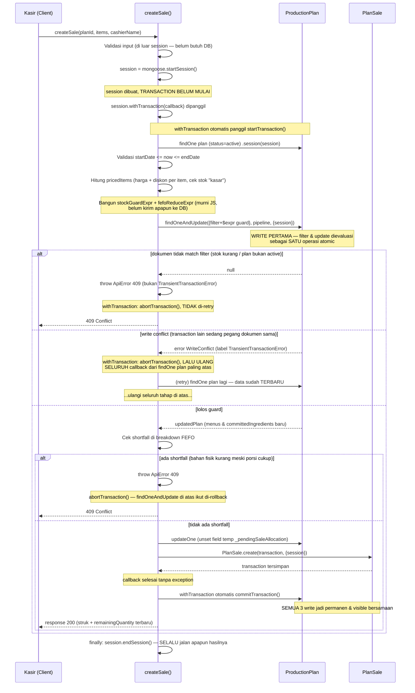
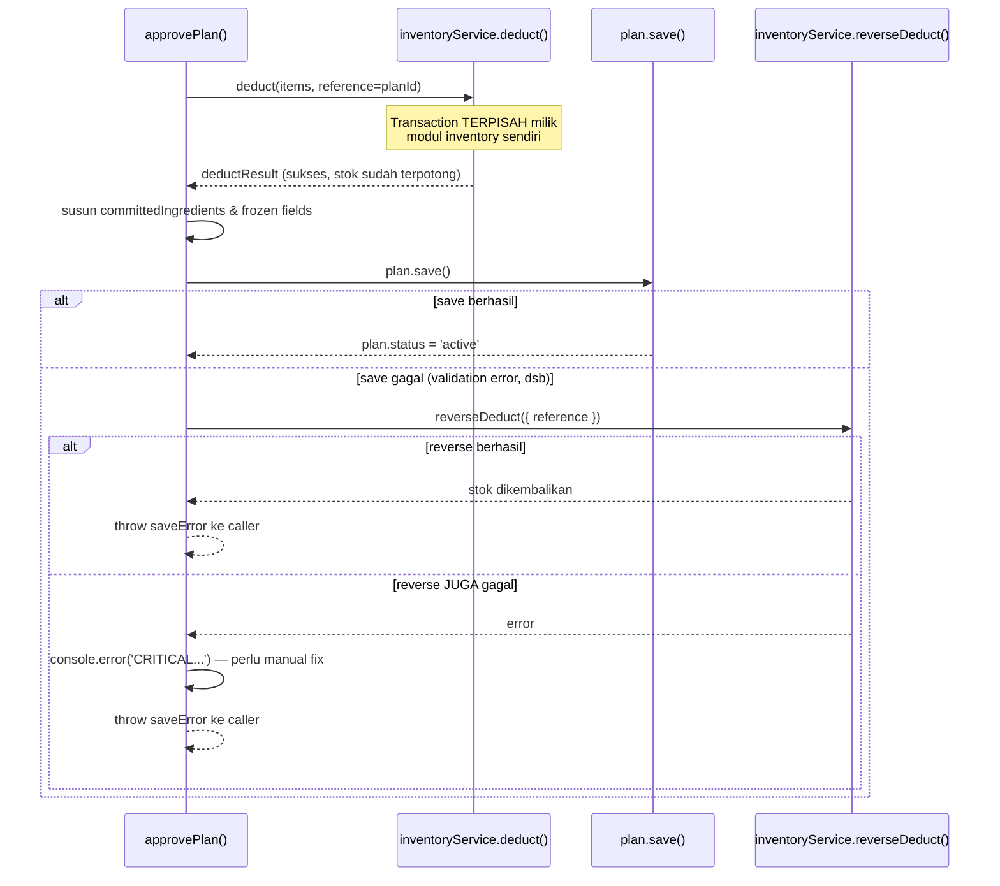

# Dokumentasi Flow & ACID Transaction Modul Selling & Production Plan (KADA)

> Dokumen ini menjelaskan skema data yang terlibat, alur bisnis end-to-end, dan bagaimana konsep ACID transaction diterapkan di service `selling.service.js` beserta interaksinya dengan `ProductionPlan`.

---

## 1. Gambaran Umum

Modul ini menangani proses **penjualan porsi menu** dari sebuah `ProductionPlan` yang sedang `active`. Setiap transaksi penjualan menyentuh **dua collection sekaligus**:

| Collection       | Peran dalam transaksi                                                                                                              |
| ---------------- | ---------------------------------------------------------------------------------------------------------------------------------- |
| `ProductionPlan` | Sumber kebenaran stok porsi (`quantityPlanned/soldQuantity/lossQuantity`) dan stok bahan mentah per-batch (`committedIngredients`) |
| `PlanSale`       | Log transaksi (struk) — bukti penjualan yang immutable setelah dibuat                                                              |

Karena dua collection ditulis dalam satu aksi bisnis ("kasir mencatat penjualan"), operasi ini **wajib atomic**: kalau salah satu write gagal, semuanya harus batal — tidak boleh ada stok yang berkurang tanpa struk, atau struk tercatat tanpa stok yang benar-benar dipotong.

---

## 2. Skema Data

### 2.1 `PlanSale` (skema utuh, dari kode yang kamu berikan)

```
PlanSale
├── planId          : ObjectId → ref ProductionPlan (required)
├── cashierName      : String (required, trim)
├── soldAt           : Date (required, default: now)
├── items[]          : SaleItem (required, minimal 1 item)
└── timestamps       : createdAt, updatedAt (otomatis dari { timestamps: true })
```

**`SaleItem` (subdocument, `_id: false`)**

| Field                | Tipe                | Keterangan                                                          |
| -------------------- | ------------------- | ------------------------------------------------------------------- |
| `menuId`             | ObjectId → `Menu`   | referensi menu yang dijual                                          |
| `menuName`           | String              | **snapshot** nama menu saat transaksi (bukan live-lookup ke `Menu`) |
| `quantitySold`       | Number, min 1       | jumlah porsi terjual                                                |
| `originalPrice`      | Number, min 0       | harga normal sebelum diskon                                         |
| `priceUsed`          | Number, min 0       | harga final yang dibayar customer                                   |
| `discountApplied`    | Boolean             | apakah diskon aktif saat transaksi                                  |
| `discountPercentage` | Number 1–100 / null | persentase diskon (null kalau tidak diskon)                         |
| `ingredientsUsed[]`  | `IngredientUsage`   | breakdown bahan yang terpakai untuk item ini                        |

**`IngredientUsage` (subdocument)**

| Field           | Tipe                   | Keterangan                                                                                                  |
| --------------- | ---------------------- | ----------------------------------------------------------------------------------------------------------- |
| `inventoryId`   | ObjectId → `Inventory` | jenis bahan (mis. "Kopi Arabika")                                                                           |
| `nameInventory` | String                 | snapshot nama bahan                                                                                         |
| `batches[]`     | `BatchUsage`           | batch spesifik mana saja yang kepotong (bisa lebih dari satu batch kalau FEFO harus "nyambung" antar batch) |

**`BatchUsage` (subdocument)**

| Field            | Tipe                      | Keterangan                         |
| ---------------- | ------------------------- | ---------------------------------- |
| `subInventoryId` | ObjectId → `SubInventory` | batch fisik spesifik               |
| `batchCode`      | String                    | kode batch                         |
| `quantityUsed`   | Number                    | jumlah yang diambil dari batch ini |
| `expired`        | Date / null               | tanggal kedaluwarsa batch tsb      |

**Kenapa `menuName`, `originalPrice`, `nameInventory`, dll di-snapshot (bukan referensi live)?**
Ini pola **historical accuracy / audit trail**. Kalau suatu saat nama menu diganti admin atau harga bahan berubah, struk transaksi lama **tidak boleh ikut berubah** — struk merepresentasikan kondisi _pada saat kejadian_, bukan kondisi saat ini. Ini juga alasan kenapa kamu sudah punya konsep "frozen" di level `ProductionPlan` (dibahas di 2.2).

Dua index yang didefinisikan:

```js
planSaleSchema.index({ planId: 1, soldAt: -1 }); // query riwayat per-plan, terbaru dulu
planSaleSchema.index({ cashierName: 1, soldAt: -1 }); // query riwayat per-kasir
```

Keduanya compound index dengan `soldAt: -1` supaya query "transaksi terbaru dari plan X" atau "transaksi kasir Y" bisa langsung pakai index untuk sorting, tanpa in-memory sort.

### 2.2 `ProductionPlan` (skema utuh, dari model asli `productionPlan.model.js`)

```
ProductionPlan
├── name, tags[]
├── startDate, duration (7–30 hari), endDate
├── status                    : 'draft' | 'active' | 'completed' | 'stopped' | 'cancelled'
├── menus[]                   : PlanMenu[]              (min 1 menu)
├── checkResult[]              : CheckResult[]           (hanya relevan saat draft — hasil simulasi)
├── checkResultStale, staleReason, readyToApprove
├── committedIngredients[]    : CommittedIngredient[]    (hanya terisi setelah approve)
├── hasPendingLossReplacement : Boolean
├── approvedAt / approvedBy
├── stoppedAt / stoppedBy / stopReason
├── cancelledAt / completedAt
└── timestamps                : createdAt, updatedAt
```

**`PlanMenu` (per-menu di dalam plan)** — sebagian field kosong (`null`) selama `draft`, baru diisi ("dibekukan") saat `approvePlan`:

| Field                          | Terisi sejak              | Keterangan                                                                                                                                                                     |
| ------------------------------ | ------------------------- | ------------------------------------------------------------------------------------------------------------------------------------------------------------------------------ |
| `menuId`                       | create                    | referensi ke `Menu` asli                                                                                                                                                       |
| `quantityPlanned`              | create                    | total porsi yang direncanakan                                                                                                                                                  |
| `soldQuantity`, `lossQuantity` | create (default 0)        | akumulasi live, diupdate oleh `Selling` & `Loss Report` module                                                                                                                 |
| `soldOutAt`                    | live                      | timestamp kapan menu ini habis (null kalau belum)                                                                                                                              |
| `frozenSellingPrice`           | **approve**               | snapshot `menuDoc.sellingPrice`                                                                                                                                                |
| `frozenMenuName`               | **approve**               | snapshot `menuDoc.name`                                                                                                                                                        |
| `frozenMenuImage`              | **approve**               | snapshot `menuDoc.image`                                                                                                                                                       |
| `frozenRecipe[]`               | **approve**               | snapshot resep: `{ inventoryId, nameInventory, unit, quantityPerUnit }` — basis hitung kebutuhan bahan per porsi, independen dari resep `Menu` yang mungkin berubah belakangan |
| `discount`                     | kapan saja (draft/active) | via `setDiscount`/`removeDiscount`, lihat A9/A10                                                                                                                               |

Formula stok tersisa yang dipakai berulang di service (Selling module):

```
remainingQuantity = max(0, quantityPlanned - soldQuantity - lossQuantity)
```

**`CheckResult` (hasil simulasi ketersediaan bahan, hanya untuk `draft`)**

| Field                                                            | Keterangan                                                                                              |
| ---------------------------------------------------------------- | ------------------------------------------------------------------------------------------------------- |
| `inventoryId`, `nameInventory`, `unit`                           | identitas bahan                                                                                         |
| `quantityNeeded`, `availableQuantity`, `sufficient`, `shortfall` | hasil dry-run cek stok, **belum ada reservasi apapun** di titik ini                                     |
| `hasUnsafeBatch`                                                 | apakah ada batch berstatus unsafe di antara kandidat                                                    |
| `eligibleBatches[]`                                              | `{ subInventoryId, quantityTaken, expired, batchSafetyStatus }` — kandidat batch, bukan reservasi final |

Ini beda konseptual penting dari `committedIngredients`: `checkResult` = simulasi ("kalau di-approve sekarang, kira-kira cukup gak"), sedangkan `committedIngredients` = reservasi nyata yang sudah memotong stok fisik.

**`CommittedIngredient` (bahan yang sudah benar-benar dipotong dari inventory saat approve)**

| Field                                  | Keterangan                                            |
| -------------------------------------- | ----------------------------------------------------- |
| `inventoryId`, `nameInventory`, `unit` | identitas bahan                                       |
| `quantityNeeded`                       | total kebutuhan bahan ini lintas semua menu di plan   |
| `batches[]`                            | daftar batch fisik yang sudah dipotong untuk plan ini |

**`CommittedBatch`**

| Field                         | Keterangan                                                                                                            |
| ----------------------------- | --------------------------------------------------------------------------------------------------------------------- |
| `subInventoryId`, `batchCode` | identitas batch                                                                                                       |
| `quantityUsed`                | jumlah **original** yang dipotong saat approve — nilai ini **tidak pernah berubah**, dipakai untuk audit & basis cost |
| `quantityRemaining`           | sisa **live**, di-decrement oleh `createSale` (FEFO) tiap ada penjualan                                               |
| `costPriceUsed`               | harga modal per unit dari batch ini saat dipotong — basis hitung `costPerPortion`/`estimatedProfit`                   |
| `batchSafetyStatus`           | `'safe'` \| `'unsafe'`                                                                                                |
| `expired`                     | tanggal kedaluwarsa — **dasar urutan FEFO**                                                                           |

Perhatikan pemisahan `quantityUsed` (frozen, untuk audit cost) vs `quantityRemaining` (live, untuk cek stok) — pola yang sama dengan `frozenSellingPrice` vs harga live: **angka yang dipakai untuk pelaporan/cost harus immutable, angka yang dipakai untuk cek ketersediaan harus live**.

**Index penting yang mudah terlewat:**

```js
productionPlanSchema.index(
  { status: 1 },
  { unique: true, partialFilterExpression: { status: 'active' }, name: 'only_one_active_plan' }
);
```

Ini **unique partial index** — MongoDB menjamin di level storage engine bahwa **tidak mungkin ada dua dokumen dengan `status: 'active'` sekaligus**, apapun yang terjadi di application code. Ini lapis pertahanan tambahan yang independen dari `assertOnlyOneActivePlan()` di service (dibahas di bagian 5).

**Kenapa ada dua "level" stok (`PlanMenu.quantityPlanned` vs `CommittedIngredient.batches`)?**
Karena satu transaksi penjualan menyentuh dua unit pengukuran berbeda sekaligus:

- **Porsi menu** — yang dijual ke customer ("3 Nasi Goreng")
- **Bahan mentah** — yang benar-benar dipotong dari gudang ("300g beras dari batch B-001, 50g dari batch B-002")

Satu porsi menu bisa butuh banyak bahan, dan satu jenis bahan bisa dipenuhi dari banyak batch (kalau satu batch kurang, nyambung ke batch berikutnya sesuai urutan FEFO). Inilah kenapa `createSale` harus mengubah `menus[].soldQuantity` **dan** `committedIngredients[].batches[].quantityRemaining` **dalam satu operasi yang sama** — dua-duanya representasi dari satu kejadian nyata yang sama (porsi terjual = bahan terpakai), jadi tidak boleh salah satu berhasil dan satunya gagal.

---

## 3. Alur Bisnis End-to-End — `createSale`

### 3.0 Kerangka besar: `session`, `try/finally`, dan `withTransaction`

Sebelum masuk ke tahap-tahap bisnisnya, penting dipahami dulu **kerangka teknis** yang membungkus semuanya, karena ini yang paling sering disalahpahami.

```js
const session = await mongoose.startSession(); // (a)
try {
  let response;
  await session.withTransaction(async () => {
    // (b)
    // ...seluruh logic bisnis di sini...
  });
  return response;
} finally {
  session.endSession(); // (c)
}
```

**(a) `mongoose.startSession()` hanya membuat objek session — belum ada transaction yang mulai.** Session adalah jalur koneksi yang nanti _menampung_ satu transaction pada satu waktu. Di titik ini, database belum tahu apa-apa soal "transaksi" yang akan terjadi.

**(b) `session.withTransaction(callback)` adalah helper yang membungkus seluruh siklus hidup transaction.** Tanpa helper ini, kamu harus menulis manual:

```js
session.startTransaction();
try {
  await doSomething({ session });
  await session.commitTransaction();
} catch (err) {
  await session.abortTransaction();
  throw err;
}
```

`withTransaction` menggantikan semua boilerplate itu, **plus** menambahkan satu kemampuan penting yang tidak ada di pola manual di atas: **retry otomatis**. Secara garis besar, isi internalnya kira-kira begini:

```js
async function withTransaction(fn, options) {
  const deadline = Date.now() + 120_000; // batas waktu retry keseluruhan
  while (true) {
    session.startTransaction(options);
    try {
      const result = await fn(); // callback kamu dijalankan
      try {
        await session.commitTransaction();
        return result;
      } catch (commitErr) {
        if (isRetryable(commitErr) && Date.now() < deadline) continue; // ulang SEMUA
        throw commitErr;
      }
    } catch (err) {
      await session.abortTransaction(); // rollback otomatis
      if (hasErrorLabel(err, 'TransientTransactionError') && Date.now() < deadline) {
        continue; // ulang dari session.startTransaction() lagi, callback dipanggil ULANG DARI AWAL
      }
      throw err; // propagate apa adanya
    }
  }
}
```

Ini kenapa kode `createSale` **tidak pernah** memanggil `session.startTransaction()` / `commitTransaction()` / `abortTransaction()` secara eksplisit — semuanya sudah terjadi _di dalam_ `withTransaction`. Yang perlu kamu sediakan cuma callback-nya.

**(c) `session.endSession()` diletakkan di `finally`, dan sengaja tidak ada `catch`.** Dua alasan:

1. `endSession()` bukan bagian dari siklus hidup _transaction_ (commit/abort) — dia bagian dari siklus hidup _session_ (resource koneksi itu sendiri). Session harus dibersihkan **apapun** hasil transaction-nya: sukses, gagal karena error bisnis, atau gagal setelah semua retry habis.
2. Kalau `endSession()` ditaruh di dalam `try` setelah `withTransaction` (tanpa `finally`), dan `withTransaction` melempar error, baris itu **tidak akan pernah tereksekusi** — `throw` langsung melompat keluar `try`, session bocor (tidak pernah dilepas ke server).
3. Tidak adanya `catch` berarti: error dari `withTransaction` (baik `ApiError` bisnis 404/409, maupun error MongoDB lain) **sengaja dibiarkan mengalir** ke pemanggil `createSale()` (biasanya controller). Fungsi ini tidak "menangani" error tersebut — dia cuma memastikan resource-nya beres sebelum error itu terus mengalir ke atas.

Singkatnya: **`try/catch` itu soal menangani kesalahan bisnis, `try/finally` di sini murni soal housekeeping koneksi** — dua kepentingan berbeda yang kebetulan sama-sama pakai `try`.

### 3.1 Diagram alur



### 3.2 Tahap per tahap

**Tahap 1 — Validasi sinkron (sebelum `startSession` sekalipun)**

```js
if (!Array.isArray(items) || items.length === 0) throw ...
if (duplicate menuId) throw ...
```

Ini validasi yang **tidak butuh akses database sama sekali** — cukup mengecek bentuk input. Diletakkan sebelum `startSession()` supaya tidak membuka resource koneksi untuk sesuatu yang bisa gagal tanpa menyentuh data sama sekali.

**Tahap 2 — `startSession()`, lalu masuk `withTransaction`, lalu baca plan**

```js
const plan = await ProductionPlan.findOne({ _id: planId, status: 'active' }).session(session);
if (!plan) throw ApiError(404, ...)
if (now < plan.startDate) throw ...
if (now > plan.endDate) throw ...
```

Read ini terjadi _di dalam_ callback `withTransaction`, ikut snapshot isolation transaction (bagian 4.3). **Poin krusial:** kalau nanti terjadi retry (write conflict di tahap 6), seluruh callback — termasuk `findOne` ini — dipanggil ulang dari awal. Itu sebabnya fetch data **wajib** ada di dalam callback, bukan di luar: supaya saat diulang, data yang dibaca adalah data terbaru, bukan basi dari percobaan sebelumnya.

**Tahap 3 — Hitung harga per item (`pricedItems`)**
Memanggil `computePricing(planMenu, null, plan.status)` — pakai `frozenSellingPrice` (bukan harga live) dan cek `discountStatus`. Ini murni komputasi di memory. Pengecekan `remainingQuantity >= quantitySold` di tahap ini **bersifat optimistis** — berdasarkan data `plan` yang baru dibaca, belum tentu masih akurat sepersekian detik kemudian. Guard yang benar-benar final ada di tahap 5.

**Tahap 4 — Bangun `stockGuardExpr` & `fefoReduceExpr` (murni komputasi JS, TIDAK menyentuh DB)**

Di sini kita tidak "mengobrol" ke database — kita **menyusun instruksi** yang nanti dikirim sekaligus sebagai satu paket ke MongoDB. Ini prinsip dasar aggregation pipeline: alih-alih pola biasa (_ambil data → hitung di aplikasi → kirim hasil balik_) yang punya jeda waktu antara baca dan tulis, di sini **perhitungan dan penulisan digabung jadi satu instruksi** yang dijalankan MongoDB sendiri tepat saat menulis — sehingga tidak ada celah waktu yang bisa disela transaction lain.

_`stockGuardExpr`_ — pertanyaan ya/tidak untuk setiap item: "cari menu di `plan.menus` yang `menuId`-nya cocok dengan yang dipesan; kalau ketemu, cek apakah `(quantityPlanned - soldQuantity - lossQuantity) >= quantitySold`". Semua item dalam transaksi harus lolos (`$and`).

_`menuUpdateBranches`_ — instruksi update kalau lolos: tambah `soldQuantity`, dan tandai `soldOutAt` kalau sisa jadi nol.

_`itemsForFefo`_ — masih JS biasa, menyiapkan total kebutuhan bahan per item berdasarkan `frozenRecipe`.

_`fefoWalkOneIngredient`_ — inti logika FEFO untuk **satu jenis bahan**: urutkan batch berdasarkan `expired` ascending, lalu untuk tiap batch (dari yang paling cepat kedaluwarsa) ambil sebanyak `min(sisa kebutuhan, sisa batch)`, kurangi keduanya, catat berapa yang diambil. Ulangi sampai kebutuhan terpenuhi atau batch habis.

Contoh konkret — beli 3 porsi Nasi Goreng, butuh 300g beras, tersedia di 2 batch:

```
Batch A: sisa 150g, kedaluwarsa besok    →  urutan ke-1 (FEFO)
Batch B: sisa 500g, kedaluwarsa minggu depan  →  urutan ke-2

remainingNeed = 300
→ Batch A: allocate = min(300, 150) = 150 → remainingNeed = 150, Batch A sisa 0
→ Batch B: allocate = min(150, 500) = 150 → remainingNeed = 0,   Batch B sisa 350
→ selesai, remainingNeed = 0 (semua kebutuhan terpenuhi)
```

Kalau total stok kedua batch cuma 200g (bukan 650g), maka `remainingNeed` akan tersisa **100** setelah semua batch disedot habis — angka sisa inilah yang menjadi `shortfall`, dan itu artinya "porsi menu kelihatan cukup di `stockGuardExpr`, tapi bahan fisiknya sebenarnya kurang".

_`applyItemToCommittedIngredients`_ — jalankan `fefoWalkOneIngredient` untuk **setiap bahan** yang dibutuhkan **satu item** menu (satu menu biasanya butuh lebih dari satu bahan).

_`fefoReduceExpr`_ — jalankan `applyItemToCommittedIngredients` untuk **setiap item** dalam transaksi, secara berurutan, sambil terus mengakumulasi sisa stok yang sudah ter-update — supaya item kedua menghitung sisa **setelah** item pertama "mengambil jatah"-nya duluan, bukan dari sisa awal yang sama.

**Tahap 5 — `findOneAndUpdate`: write pertama, dan titik paling kritikal untuk race condition**

```js
const updatedPlan = await ProductionPlan.findOneAndUpdate(
  { _id: planId, status: 'active', $expr: stockGuardExpr },
  [/* pipeline: update menus, committedIngredients, _pendingSaleAllocation */],
  { session, new: true }
);
```

Ini **operasi pertama yang benar-benar dikirim ke MongoDB** dalam transaction ini. Filter (termasuk `$expr`) dan update dieksekusi sebagai **satu gerakan atomic** oleh storage engine: tidak ada celah waktu antara "cek kondisi" dan "tulis hasilnya" yang bisa disela operasi lain.

Ada **dua skenario berbeda** yang menghasilkan "kegagalan" di titik ini — dan keduanya sering tertukar:

|                                                       | Skenario A — filter tidak match                                                                                                                                             | Skenario B — write conflict                                                                                                                                                                                                            |
| ----------------------------------------------------- | --------------------------------------------------------------------------------------------------------------------------------------------------------------------------- | -------------------------------------------------------------------------------------------------------------------------------------------------------------------------------------------------------------------------------------- |
| Apa yang terjadi                                      | MongoDB **sempat** mengevaluasi filter (`status: 'active'` + `stockGuardExpr`), tapi tidak ada dokumen yang cocok — stok memang kurang, atau plan sudah bukan `active` lagi | MongoDB **belum sempat** mengevaluasi filter apapun — dokumen ini sedang "dipegang" oleh transaction lain yang belum commit/abort. MongoDB menunggu sebentar (≤5ms, `maxTransactionLockRequestTimeoutMillis`), lalu menyerah           |
| Hasil yang diterima kode kamu                         | `null` (bukan error — jawaban valid "tidak ada yang cocok")                                                                                                                 | Error `WriteConflict` (code 112), berlabel `TransientTransactionError`                                                                                                                                                                 |
| Siapa yang putuskan jadi error 409                    | **Kamu sendiri**, lewat `if (!updatedPlan) throw ApiError(409, ...)`                                                                                                        | **MongoDB sendiri** yang melempar error ini                                                                                                                                                                                            |
| Apakah di-retry oleh `withTransaction`                | **Tidak** — ini `ApiError` biasa, bukan `TransientTransactionError`, langsung abort & propagate                                                                             | **Ya** — `withTransaction` menangkap label ini, `abortTransaction()`, lalu memanggil ulang **seluruh callback dari `findOne` plan di tahap 2**                                                                                         |
| Kenapa retry mengulang semuanya, bukan cuma baris ini | —                                                                                                                                                                           | Karena data yang dibaca di tahap 2 (percobaan pertama) sudah berpotensi basi — proses lain yang tadi "pegang duluan" mungkin sudah selesai dan mengubah stok. Mengulang dari awal memastikan perhitungan berikutnya memakai data segar |

Ilustrasi Skenario B dengan dua kasir memperebutkan porsi terakhir:

```
Kasir A                              Kasir B
─────────────────────                ─────────────────────
baca plan: sisa = 1                  baca plan: sisa = 1
(snapshot masing-masing, keduanya "yakin" cukup di titik ini)

findOneAndUpdate → MULAI menulis
  dokumen "dipegang" Kasir A
                                      findOneAndUpdate → coba menulis
                                        dokumen sama → terdeteksi
                                        masih dipegang Kasir A → tunggu ≤5ms
filter match, sisa jadi 0
commit SUKSES, sisa=0 permanen
                                        5ms habis, Kasir A belum commit
                                        → WriteConflict, label TransientTransactionError
                                        → withTransaction ULANG SELURUH callback

                                      (retry) baca plan LAGI → sisa = 0 (data terbaru)
                                      hitung: quantitySold(1) > remaining(0)
                                      → throw ApiError 409 (bisnis, BUKAN retry lagi)
                                      → Kasir B: "stok tidak cukup"
```

Ini yang mencegah oversell: Kasir B sempat "salah baca" di percobaan pertama, tapi write-conflict detection memaksa dia membaca ulang data terbaru sebelum benar-benar menulis apapun.

**Tahap 6 — Cek `shortfall` dari hasil FEFO**

```js
const pendingSaleAllocation = updatedPlan.get('_pendingSaleAllocation') || [];
```

`_pendingSaleAllocation` bukan path resmi di schema — cuma "tempat parkir" sementara hasil `_fefoResult.breakdown` dari pipeline update, dibaca lewat `.get()` karena mongoose tidak membuat getter untuk path yang tidak terdaftar di schema. Kalau ada `shortfall > 0`, artinya porsi menu lolos `stockGuardExpr` tapi bahan fisiknya sebenarnya tidak cukup (kemungkinan ada bahan hilang/rusak yang belum dilaporkan). `throw ApiError 409` di sini — sama seperti Skenario A, ini keputusan bisnis, bukan `TransientTransactionError`, jadi tidak di-retry. Meski `findOneAndUpdate` di tahap 5 sudah "terlanjur" menulis, karena `throw` ini terjadi **sebelum** commit, `withTransaction` akan membatalkan semua yang sudah dicoba tulis — dokumen `ProductionPlan` kembali seperti semula, tidak ada perubahan setengah jalan yang tersisa.

**Tahap 7 — Bersihkan field temporary & buat record `PlanSale`**

```js
await ProductionPlan.updateOne({ _id: planId }, { $unset: { _pendingSaleAllocation: '' } }, { session });
const [transaction] = await PlanSale.create([{ ... }], { session });
```

Dua write tambahan, keduanya tetap memakai `{ session }` yang sama — kalau salah satu gagal, write-write sebelumnya (termasuk `findOneAndUpdate` di tahap 5) ikut dibatalkan bersamaan.

**Tahap 8 — Callback selesai tanpa exception → commit**
Setelah semua write di atas berhasil dan `response` tersusun, callback selesai secara normal. `withTransaction` otomatis memanggil `commitTransaction()`. Kalau sukses, ketiga write (tahap 5, 7) menjadi permanen dan visible ke luar transaction secara bersamaan — seolah terjadi dalam satu kedipan mata. Kalau commit itu sendiri gagal dengan `UnknownTransactionCommitResult` (misal koneksi putus tepat saat commit dikirim), `withTransaction` akan mengulang lagi dari `startTransaction()`, persis seperti alur retry di Skenario B.

**Tahap 9 — `finally: session.endSession()`**
Baris ini dijamin selalu jalan, apapun yang terjadi di atas — baik commit sukses, baik `ApiError` dilempar setelah retry (kalau ada) habis, atau error tak terduga lain. Ini murni soal melepas resource koneksi; error yang terjadi tetap dibiarkan mengalir ke pemanggil `createSale()` untuk dipetakan jadi HTTP response yang sesuai.

---

## 4. Konsep ACID di MongoDB (diterapkan ke kasus kamu)

### 4.1 Atomicity

> **Semua write dalam satu transaction berhasil bersama, atau tidak sama sekali.**

Di `createSale`, ada 3 write terpisah secara logis:

1. `findOneAndUpdate` pada `ProductionPlan` (decrement stok)
2. `updateOne` pada `ProductionPlan` (bersihkan field temp)
3. `PlanSale.create` (buat struk)

Tanpa transaction, kalau proses crash tepat setelah write #1 sukses tapi sebelum write #3 selesai, kamu akan punya `ProductionPlan` dengan stok yang sudah berkurang, tapi **tidak ada struk** yang membuktikan kenapa. Dengan `session.withTransaction()`, MongoDB menjamin ketiga write ini adalah satu unit — kalau proses crash di tengah, saat restart tidak ada satupun dari ketiga write itu yang ter-commit ke storage yang bisa dibaca operasi lain.

Penting dibedakan dari **atomicity level-dokumen** (yang sudah otomatis ada di MongoDB tanpa transaction sama sekali): update pada `findOneAndUpdate` di step 6 itu sendiri sudah atomic terhadap satu dokumen `ProductionPlan`, bahkan kalau kamu jalankan di luar session. Transaction dibutuhkan justru untuk menyatukan atomicity itu **lintas dokumen** (`ProductionPlan` + `PlanSale`).

### 4.2 Consistency

> **Transaction membawa database dari satu state valid ke state valid lain**, sesuai constraint yang kamu definisikan (schema validation, business rule).

Di kode kamu, consistency dijaga oleh kombinasi:

- Schema validation mongoose (`min: 1`, `required: true`, dsb) — dicek saat `PlanSale.create`.
- Business rule di `stockGuardExpr` — memastikan `soldQuantity` tidak pernah melebihi `quantityPlanned - lossQuantity`.
- Business rule shortfall check — memastikan tidak ada `PlanSale` yang tercipta kalau bahan sebenarnya tidak cukup.

Kalau salah satu constraint ini gagal, exception di-throw → transaction abort → database tetap di state sebelumnya (valid), tidak pernah "setengah update".

### 4.3 Isolation

> **Transaction yang sedang berjalan tidak melihat perubahan "kotor" (belum commit) dari transaction lain, dan transaction lain tidak melihat perubahan kamu sampai kamu commit.**

MongoDB pakai **snapshot isolation** untuk multi-document transaction. Ini artinya:

- Read di dalam transaction kamu (`findOne plan` di step 2) melihat data seolah-olah "dibekukan" sejak transaction dimulai.
- Transaction lain yang berjalan bersamaan (concurrent) tidak bisa melihat write kamu sampai kamu `commitTransaction()`.

**Apa yang terjadi kalau dua transaction sama-sama menulis ke dokumen `ProductionPlan` yang sama, bersamaan?**
MongoDB mendeteksi ini sebagai **write conflict** (error code `112 WriteConflict`). Salah satu transaction akan gagal dengan label error `TransientTransactionError`. Driver MongoDB (dan `session.withTransaction()` secara spesifik) akan **otomatis retry seluruh callback** ketika menemukan error berlabel ini — jadi transaction yang kalah akan mengulang dari awal: fetch plan lagi, hitung ulang FEFO, cek ulang stok, sampai berhasil atau sampai `maxCommitTimeMS` habis (default: tidak ada batas keras, tapi disarankan diset eksplisit).

Karena inilah, **efek isolation + retry ini yang jadi "penjaga" utama terhadap race condition antar-transaction** yang kamu khawatirkan — bukan kode manual yang perlu kamu tulis sendiri, tapi behavior bawaan MongoDB yang kamu dapatkan gratis selama kamu konsisten pakai `session` di semua operasi write.

**Catatan penting:** karena callback bisa di-replay, callback **tidak boleh punya side effect di luar database** yang tidak idempotent (misal: kirim email, panggil API eksternal, push notifikasi) tanpa proteksi tambahan. Kode kamu di `createSale` sudah aman dari sisi ini — semua operasi di dalam callback murni database write via `session`.

### 4.4 Durability

> **Setelah commit berhasil, perubahan permanen — bertahan meski ada crash server setelahnya.**

Ini dikontrol oleh **write concern**. Default `session.withTransaction()` biasanya `writeConcern: { w: 'majority' }`, artinya commit baru dianggap sukses setelah **mayoritas node di replica set** sudah menulis perubahan ke disk (bukan cuma primary). Ini penting untuk data finansial seperti `PlanSale` — kalau primary node mati tepat setelah commit tapi sebelum replikasi selesai, ada risiko data hilang saat failover kalau write concern-nya cuma `w: 1`.

**Rekomendasi eksplisit untuk kasus kamu:**

```js
await session.withTransaction(
  async () => {
    /* ...seluruh logic createSale... */
  },
  {
    readConcern: { level: 'snapshot' },
    writeConcern: { w: 'majority' },
    maxCommitTimeMS: 5000,
  }
);
```

---

## 5. Alur `approvePlan` — Pola Berbeda: Saga / Compensating Action (BUKAN ACID Transaction)

Ini penemuan penting yang perlu kamu sadari: **`approvePlan` tidak memakai `session.withTransaction()` sama sekali**, berbeda dari `createSale`. Ini bukan berarti kodenya salah — tapi mekanisme keamanannya beda jenis, dan kamu perlu paham trade-off-nya karena ini bagian paling kritikal (memotong stok fisik gudang berdasarkan hasil simulasi).

### 5.1 Kenapa `approvePlan` tidak (atau tidak bisa) pakai transaction tunggal



Lihat komentar di kode kamu sendiri:

```js
// Step 1 — deduct semua bahan sekaligus (1 transaction di dalam deduct()
// sendiri). Kalau gagal, semua bahan di batch ini otomatis rollback.
deductResult = await inventoryService.deduct({ ... });
...
// Step 2 — commit plan jadi active.
try {
  plan.committedIngredients = deductResult.items.map(...);
  plan.menus = plan.menus.map(...); // freeze harga/nama/resep
  plan.status = 'active';
  await plan.save();
} catch (saveError) {
  // Stok SUDAH terlanjur kepotong di Step 1 — wajib dikembalikan
  try {
    await inventoryService.reverseDeduct({ reference });
  } catch (reverseError) {
    console.error('CRITICAL: reverseDeduct gagal setelah plan.save() gagal...');
  }
  throw saveError;
}
```

`inventoryService.deduct()` punya transaction-nya **sendiri**, terpisah dari transaction (kalau ada) di `plan.save()`. Ini kemungkinan besar karena `inventoryService` adalah modul/bounded context terpisah — dia mengelola koleksi `Inventory`/`SubInventory` miliknya sendiri dan tidak "meminjamkan" session-nya ke `productionPlan.service.js`. Menyatukan keduanya dalam satu `session.withTransaction()` akan butuh `inventoryService.deduct()` menerima parameter `session` dari luar dan ikut memakainya (kalau saat ini API-nya tidak menerima `session`, itu berarti secara desain modul ini sengaja diisolasi transaction-nya).

### 5.2 Ini pola **Saga**, bukan **ACID transaction**

|                                          | ACID Transaction (`createSale`)                                                          | Saga / Compensating Action (`approvePlan`)                                                                                                                                                                                                                                 |
| ---------------------------------------- | ---------------------------------------------------------------------------------------- | -------------------------------------------------------------------------------------------------------------------------------------------------------------------------------------------------------------------------------------------------------------------------- |
| Mekanisme                                | Satu `session.withTransaction()` membungkus semua write                                  | Rangkaian **operasi lokal independen**, masing-masing punya transaction sendiri (atau tanpa transaction)                                                                                                                                                                   |
| Kalau step kedua gagal                   | Rollback **otomatis** oleh MongoDB, state kembali seperti semula, tidak ada jejak apapun | Rollback **manual** lewat `reverseDeduct()` — kode aplikasi yang harus secara eksplisit "membalikkan" efek step pertama                                                                                                                                                    |
| Kalau langkah rollback itu sendiri gagal | Tidak mungkin terjadi (rollback dijamin DB)                                              | **Bisa terjadi** — dan di kode kamu, ini ditangani dengan `console.error('CRITICAL...')` lalu tetap melempar `saveError` asli. Di titik ini sistem berada di state **inkonsisten** (stok terpotong permanen padahal plan gagal jadi `active`) sampai ada intervensi manual |
| Isolation window                         | Tidak ada — perubahan invisible ke luar sampai commit                                    | **Ada** — antara `deduct()` sukses dan `plan.save()` sukses, ada window waktu di mana stok sudah terpotong tapi plan belum `active`. Kalau ada proses lain baca stok di window itu, mereka lihat stok yang sudah berkurang untuk plan yang belum tentu jadi aktif          |

Ini bukan berarti pola Saga itu "salah" — ini adalah trade-off yang **umum dan valid** ketika sebuah operasi bisnis melintasi batas modul/service yang masing-masing punya siklus transaction sendiri (sering muncul juga di arsitektur microservices, di mana transaction lintas service secara teknis tidak mungkin dilakukan sebagai satu ACID transaction). Yang membuat pola ini "aman secukupnya" adalah:

1. **Compensating action eksplisit** (`reverseDeduct`) untuk kasus umum step-2-gagal.
2. **Logging eksplisit dan jelas** (bukan silent catch) untuk kasus terburuk (compensating action juga gagal) — supaya ada jejak untuk investigasi manual, bukan data hilang diam-diam.

### 5.3 Yang perlu kamu waspadai dari pola ini

- **Window inkonsistensi**, sekecil apapun, tetap ada secara teori. Kalau butuh eliminasi total, satu-satunya cara adalah menyatukan `deduct()` ke dalam session yang sama dengan `plan.save()` (butuh `inventoryService.deduct()` menerima `session` sebagai parameter dan dijalankan di dalam `session.withTransaction()` bersama `plan.save()`).
- **Kegagalan ganda (`reverseDeduct` gagal) adalah kondisi yang butuh alerting**, bukan cuma `console.error`. Kalau sistem produksi kamu belum ada log aggregation/alerting yang memantau baris log `CRITICAL` ini, ini titik lemah operasional — bukan bug kode, tapi gap di observability.
- **`assertOnlyOneActivePlan()` di awal `approvePlan` juga rentan TOCTOU** kalau dua request approve berjalan bersamaan untuk dua plan draft berbeda — tapi ini **sudah ditangkap** oleh `unique partial index` (`only_one_active_plan`) yang dibahas di bagian 2.2: kalaupun dua `approvePlan` lolos pengecekan `assertOnlyOneActivePlan()` bersamaan (race di level check), `plan.save()` kedua yang mencoba set `status: 'active'` akan gagal dengan duplicate key error dari MongoDB — index itu jadi jaring pengaman terakhir di level database, independen dari urutan eksekusi application code. Ini pola yang bagus: **validasi di application layer untuk UX (pesan error yang jelas), constraint di database layer untuk garansi (tidak bisa dilanggar apapun yang terjadi di race condition)**.

---

## 6. Dua Lapis Proteksi yang Bekerja Sama (khusus `createSale`)

Penting dipahami bahwa kode kamu punya **dua mekanisme berbeda** yang saling melengkapi, bukan saling menggantikan — ini elaborasi dari tabel Skenario A vs B di bagian 3.2 (Tahap 5):

| Mekanisme                                          | Level              | Melindungi dari                                                                                | Siapa yang jamin                                                                        |
| -------------------------------------------------- | ------------------ | ---------------------------------------------------------------------------------------------- | --------------------------------------------------------------------------------------- |
| `$expr` guard di `findOneAndUpdate` (Skenario A)   | Satu dokumen       | Race condition check-then-write (TOCTOU) pada dokumen yang sama                                | MongoDB storage engine (atomic per-dokumen, native, tanpa transaction pun sudah begini) |
| Write-conflict detection + auto-retry (Skenario B) | Lintas transaction | Dua transaction menulis dokumen yang sama secara tumpang-tindih waktu                          | `session.withTransaction()` (butuh replica set)                                         |
| `session.withTransaction()` secara keseluruhan     | Lintas dokumen     | Partial failure (sebagian write sukses, sebagian gagal) antara `ProductionPlan` dan `PlanSale` | MongoDB multi-document ACID transaction                                                 |

Kalau kamu **hilangkan** `$expr` guard dan ganti dengan `findOne` lalu `updateOne` terpisah (meski tetap dalam session yang sama), race condition TOCTOU-nya **tetap bisa terjadi** dalam window kecil, karena isolation level snapshot mongodb tidak otomatis melarang dua transaction membaca stok yang sama dan dua-duanya "berpikir" stok cukup — yang mencegahnya justru write-conflict detection saat kedua transaction sama-sama coba menulis ke dokumen yang sama, dan salah satunya di-retry. Guard `$expr` kamu membuat kegagalan itu terjadi **secara eksplisit dan langsung** (return `null` → error yang jelas) alih-alih bergantung sepenuhnya pada retry mechanism.

Praktik terbaik: **pakai keduanya sekaligus**, seperti yang sudah kamu lakukan — `$expr` guard sebagai lapis pertama yang cepat gagal dengan pesan jelas, transaction sebagai lapis kedua yang menjamin atomicity lintas collection.

---

## 7. Ringkasan Poin Kunci

1. **`PlanSale` adalah log append-only** — semua field penting (`menuName`, `originalPrice`, `nameInventory`) di-snapshot supaya struk lama tidak berubah meski data master berubah.
2. **`ProductionPlan.menus` dan `ProductionPlan.committedIngredients`** adalah dua representasi dari kejadian yang sama (porsi terjual = bahan terpakai), makanya harus diupdate dalam satu operasi atomic yang sama.
3. **Atomicity per-dokumen** (via `$expr` guard) sudah otomatis ada dari MongoDB, tidak butuh transaction.
4. **Atomicity lintas-dokumen di `createSale`** (`ProductionPlan` + `PlanSale`) butuh `session.withTransaction()` secara eksplisit — dan ini **sudah kamu terapkan dengan benar**.
5. **`approvePlan` memakai pola berbeda (Saga/compensating action)**, bukan ACID transaction tunggal, karena melintasi batas modul (`inventoryService`). Ini valid, tapi punya window inkonsistensi kecil dan bergantung pada `reverseDeduct()` + logging eksplisit untuk kasus kegagalan ganda.
6. **Unique partial index `only_one_active_plan`** adalah jaring pengaman database-level yang menjamin tidak pernah ada dua plan `active` sekaligus, independen dari race condition di application code.
7. **Race condition antar-request concurrent di `createSale`** ditangani oleh kombinasi: `$expr` guard (gagal cepat & jelas) + MongoDB write-conflict detection dan auto-retry di level transaction (gagal → retry seluruh callback).
8. **Freeze data saat approve plan** (harga, nama menu, resep, `quantityUsed`/`costPriceUsed` per batch) menghilangkan satu kelas race condition sepenuhnya — perubahan data master tidak pernah bisa mempengaruhi plan yang sudah berjalan, dan tetap membedakan angka yang harus immutable (untuk audit/cost) vs yang harus live (untuk cek stok, yaitu `quantityRemaining`).
9. Set `readConcern: 'snapshot'` dan `writeConcern: 'majority'` secara eksplisit untuk data sekelas transaksi finansial, jangan andalkan default driver begitu saja.

---

## 8. Referensi Lanjutan

- [MongoDB Docs — Transactions](https://www.mongodb.com/docs/manual/core/transactions/)
- [MongoDB Docs — Read Concern "snapshot"](https://www.mongodb.com/docs/manual/reference/read-concern-snapshot/)
- [MongoDB Docs — Write Concern](https://www.mongodb.com/docs/manual/reference/write-concern/)
- [MongoDB Docs — In-Transaction Error Handling (TransientTransactionError)](https://www.mongodb.com/docs/manual/core/transactions-in-applications/#retry-transaction)
- [Saga Pattern (microservices.io)](https://microservices.io/patterns/data/saga.html) — pola yang relevan untuk memahami `approvePlan`
